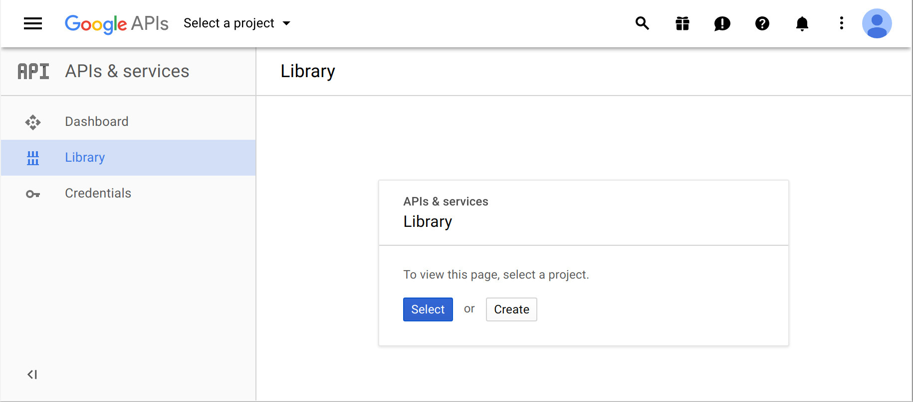
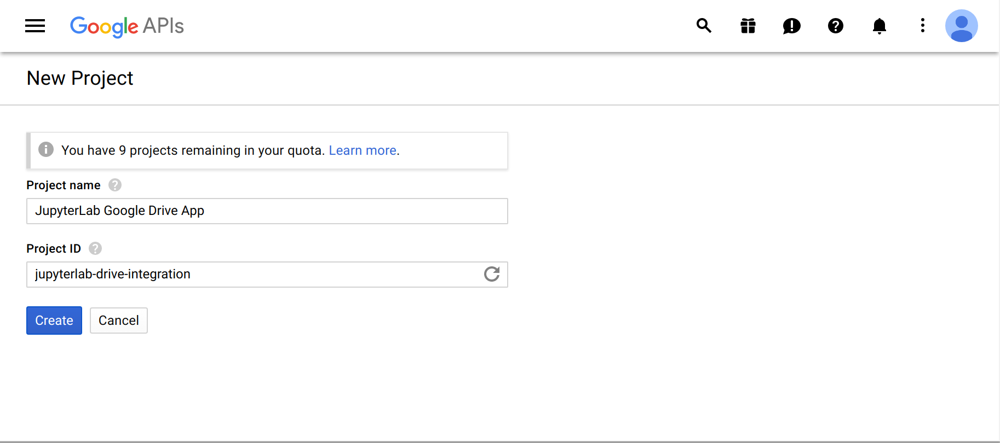
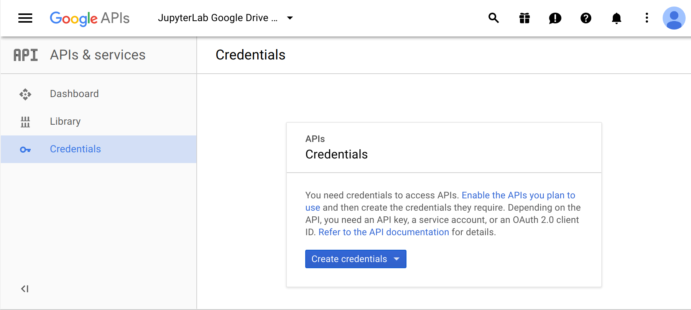
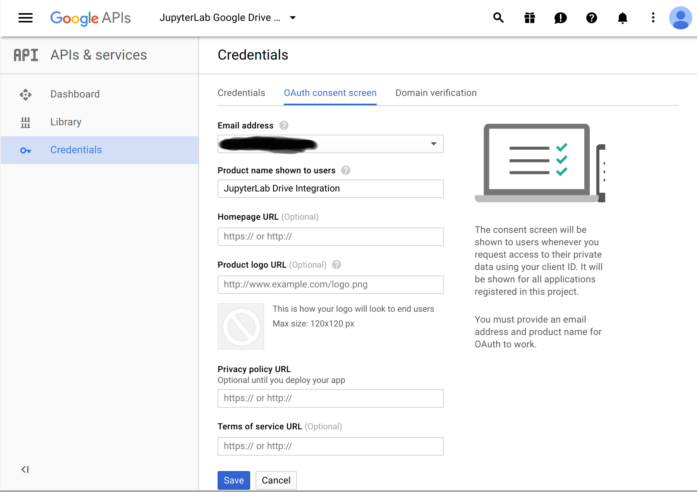
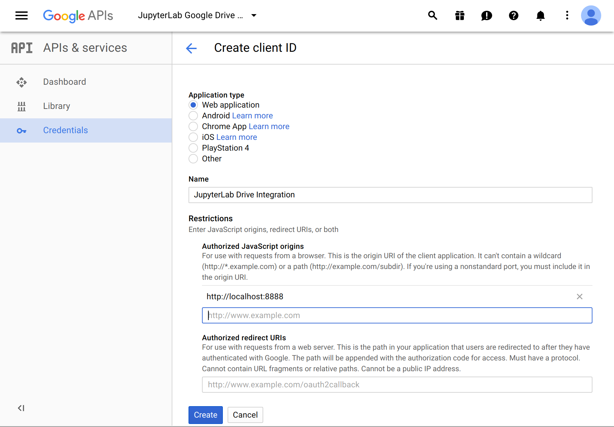
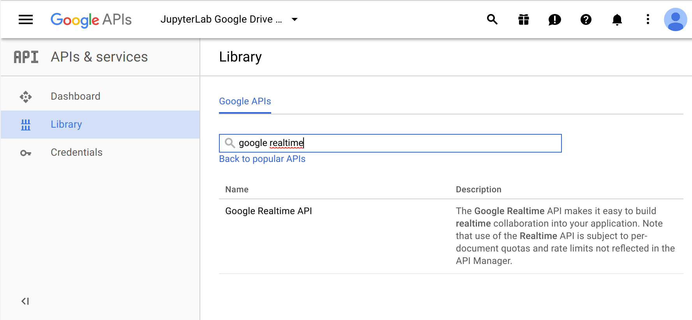
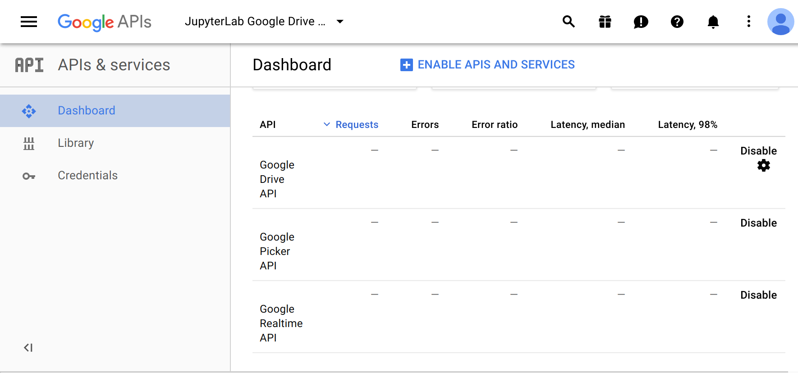

# Advanced Setup

The JupyterLab Google Drive extension makes authenticated requests to Google's servers,
and as such, must be configured to have the correct credentials.
In particular, the application must be registered with Google at the
[Google Developers Console](https://console.developers.google.com),
and the origin of the API requests must be pre-specified.
By default, the `@jupyterlab/google-drive` package uses a registered web application
that is configured to accept requests from `http://localhost`, ports `8888` through `8899`.
This is probably sufficient for local usage of the extension,
but if you are accessing the application from other origins
(such as you might do using a JupyterHub deployment),
or if you are using the extension extensively,
you will likely want to set up your own credentials with Google.

### Setup instructions
These instructions follow the ones outlined [here](https://developers.google.com/identity/sign-in/web/devconsole-project),
which should be considered authoritative.

1. Go to the [API Console](https://console.developers.google.com/projectselector/apis/library),
and select `Create` to create a new project.

2. Choose a name for the project.

3. In the **API Manager** sidebar, select **Credentials**, then select **OAuth client ID** from the **Create credentials** dropdown.

4. Click the **Configure consent screen** button and fill out the form. This configures the Google OAuth popup that will ask users for consent to use their account.

5. Select **Web application** for the application type, and provide a name for the application.
6. Under **Authorized Javascript Origins**, provide a list of URLs that will be accessing the APIs (e.g., `http://localhost:8888` or `https://www.myawsesomedeployment.org`).

7. The console will now show a **Client ID** field under the **Credentials** panel. This is the ID that will be used in the settings for the `@jupyterlab/google-drive` extension.
8. In the **API Manager** sidebar, select **Library**. This will provide an interface for enabling different Google APIs for the application. You will need to enable three APIs for the extension to work: **Google Drive API**, **Google Realtime API** and **Google Picker API**.

The Dashboard panel should now show be showing those APIs:


Once these steps have been completed, you will be able to use these credentials in the extension.
In the `jupyterlab.google-drive` settings of the settings registry, set the **clientID** field to be the client id provided by the developer console. If everything is configured properly, you should be able to use the application with your new credentials.


### Seeding JupyterLab images with Google credentials
While adding credentials via the settings functionality from within JupyterLab is possible, as described above, users may also wish to pre-seed these settings so the extension works out-of-the-box on start-up.

The location of the `@jupyterlab/google-drive` plugin's settings can be found in `$SETTINGS_PATH/@jupyterlab/google-drive/drive.json`, where `$SETTINGS_PATH` can be found by entering `jupyter lab path` on your terminal from a running JupyterLab.

For instance, the docker-stacks [base-notebook](https://github.com/jupyter/docker-stacks/blob/master/base-notebook/Dockerfile) comes pre-loaded with JupyterLab and if you were to add the google-drive extension, then given that the default user in that set-up is `jovyan`, the relevant path for the settings file would therefore be:

`home/jovyan/.jupyter/lab/user-settings/@jupyterlab/google-drive/drive.json`

As such, any file containing the credentials of the form `{ "clientId": "0123456789012-abcd2efghijklmnopqr2s9t2u6v4wxyz.apps.googleusercontent.com"}` (sample only) will need to get persisted to this location ahead of time.

There are many ways to do this.  A few to consider are:

(i) adding the file as part of a docker image-build process

One might include a `drive.json` file within a folder accessible to a Dockerfile used to build an image to be used to spawn JupyterLab.  For example, one could extend the docker-stacks base-notebook by adding the google-drive extension and pre-seed the credentials as follows:

```
FROM jupyter/base-notebook
RUN jupyter labextension install @jupyterlab/google-drive
COPY drive.json /home/jovyan/.jupyter/lab/user-settings/@jupyterlab/google-drive/drive.json
```

(ii) injecting the credentials as part of an image-spawn process

Alternatively, if one didn't want to bake-in the credentials to an image, one could pass them into a notebook server at spawn time.  Taking the [zero-to-jupyterhub-k8s](https://github.com/jupyterhub/zero-to-jupyterhub-k8s) implementation (which uses kubespawner and is therefore kubernetes-centric), for example, one could use the `config.yaml` file to:

(a) set the extraEnv to pass the clientId as an environment variable to the spawned container

```
hub
  extraEnv:
    GOOGLE_DRIVE_CLIENT_ID: "551338180476-snfu2vasacgjanovrso2j9q2j6e4capk.apps.googleusercontent.com"
```

(b) then pass that variable to the container file-system in a life-cycle hook command something like this

```
singleuser
  lifecycleHooks:
    postStart:
      exec:
        command: ["/bin/sh", "-c", "echo '{\"clientId\":\"${GOOGLE_DRIVE_CLIENT_ID}\"}' > /home/jovyan/.jupyter/lab/user-settings/@jupyterlab/google-drive/drive.json"]
``` 